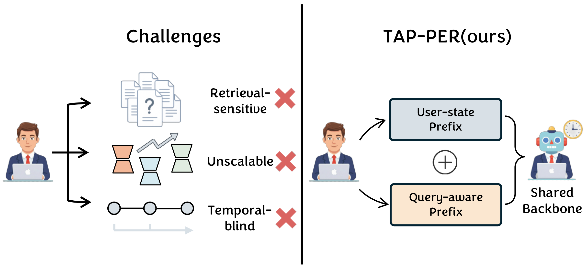
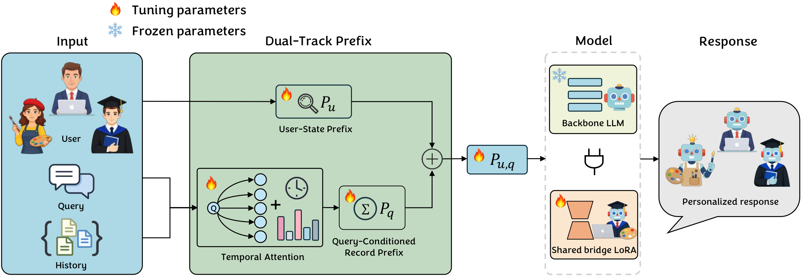

# TAP-PER

## Beyond Retrieval: Learning Compact User Representations for Scalable LLM Personalization

<p align="center">
  <strong>Accepted to Findings of the Association for Computational Linguistics: EMNLP 2026</strong>
</p>

<p align="center">
  Heng Cao, Fan Zhang, Jian Yao, Yujie Zheng, Changlin Zhao, Lu Hao,<br>
  Yuxuan Wei, Wangze Ni, Huaiyu Fu, Yuqian Sun, and Xuyan Mo
</p>

TAP-PER (**T**emporal **A**ttentive **P**refix for **PER**sonalization) is a
representation-based framework for scalable LLM personalization. Instead of
serializing a user's raw history into the prompt or storing a large adapter for
every user, TAP-PER learns a compact dual-track soft prefix and uses a small
shared LoRA module to integrate it into a task-adapted language model.

## Data

We use the public [LaMP benchmark](https://arxiv.org/abs/2304.11406). Download
the processed data from [Google Drive](https://drive.google.com/file/d/1bJ3Rh_sqrw3suwwweFbra5CTV7GVjgxF/view?usp=sharing),
extract it, and place it under `./data`.

The expected layout for each task is:

```text
data/
└── <task_name>/
    ├── user_others.json
    ├── user_top_100_history.json
    ├── user_top_100_history_label.json
    ├── profile_user_100.json       # only for text-profile baselines
    └── profile_user_others.json    # only for text-profile baselines
```

The six tasks reported in the paper are:

| Code name | LaMP task |
|---|---|
| `citation` | LaMP-1: Personalized citation identification |
| `news_categorize` | LaMP-2N: Personalized news categorization |
| `movie_tagging` | LaMP-2M: Personalized movie tagging |
| `product_rating` | LaMP-3: Personalized product rating |
| `news_headline` | LaMP-4: Personalized news headline generation |
| `scholarly_title` | LaMP-5: Personalized scholarly title generation |

## Training and Evaluation

`task_name` can be selected from `[citation, movie_tagging, news_categorize,
news_headline, product_rating, scholarly_title, tweet_paraphrase]`.

### Stage 1: Global memory

Training:

```bash
torchrun --nproc_per_node=8 task_LoRA.py --task_name movie_tagging
```

Evaluation:

```bash
python eval.py --task_name movie_tagging --k 1 --profile
```

### Stage 2: RAG prefix + PAG prefix + mediator

Training:

```bash
torchrun --nproc_per_node=8 task_LoRA_ragpag.py --task_name movie_tagging --k 10 --use_time_bias --use_order_bias
```

Evaluation:

```bash
python eval_ragpag.py --task_name movie_tagging --k 10 --use_time_bias --use_order_bias
```

### Optional: RAG prefix + mediator only

Training:

```bash
torchrun --nproc_per_node=8 task_LoRA_ragpag.py --task_name tweet_paraphrase --k 10 --disable_pag --use_time_bias --use_order_bias
```

Evaluation:

```bash
python eval_ragpag.py --task_name tweet_paraphrase --k 10 --use_time_bias --use_order_bias --disable_pag
```

## Why TAP-PER?

Existing personalized LLMs usually personalize at one of two levels:

- **Input-level personalization** retrieves user histories (RAG) or generates a
  natural-language user profile (PAG). Its behavior depends heavily on the
  retriever, profile generator, and prompt construction.
- **Parameter-level personalization** stores or generates a PEFT module for each
  user. This is effective, but its trainable storage grows quickly with the user
  population.

Both families also tend to treat a user's history as static. TAP-PER is designed
around three goals: reduce retrieval sensitivity, scale to many users, and model
the temporal evolution of user preferences.

<p align="center">
  
</p>

## Method Overview

TAP-PER represents a user with two complementary continuous prefixes:

1. **User-state prefix** $\mathbf{P}_u$: a learnable $L \times d$ embedding that
   captures persistent, query-independent preferences.
2. **Query-conditioned record prefix** $\mathbf{P}_q$: a dynamic prefix obtained
   by attending to the user's history conditioned on the current query. The
   attention score combines semantic relevance with learnable time-gap and
   order-gap biases, so recent and contextually relevant records receive more
   weight.

The prefixes are combined without an additional fusion network:

$$
\mathbf{P}_{u,q} = \mathbf{P}_u + \mathbf{P}_q.
$$

The resulting soft tokens are prepended to the query. A **shared bridge LoRA**
conditions the frozen task-adapted backbone on these prefix signals. In this
view, $\mathbf{P}_u$ is a learned counterpart of a user profile, while
$\mathbf{P}_q$ is a learned counterpart of retrieved history - both are compact
and optimized end to end rather than serialized as natural-language prompts.

<p align="center">
  
</p>

For a query representation $\mathbf{z}_q$ and a history-record representation
$\mathbf{z}_{h_j}$, TAP-PER first computes content relevance:

$$
s_j = \mathrm{MLP}\!\left(
\mathbf{z}_q \Vert \mathbf{z}_{h_j} \Vert
(\mathbf{z}_q - \mathbf{z}_{h_j}) \Vert
(\mathbf{z}_q \odot \mathbf{z}_{h_j})
\right).
$$

It then adds temporal and sequential recency biases:

$$
\widetilde{s}_j = s_j
- \lambda_t \log(1 + \Delta t_j)
- \lambda_o \log(1 + \Delta \pi_j).
$$

The normalized history representation is projected into the prefix space:

$$
\alpha_j = \mathrm{softmax}(\widetilde{s}_j), \qquad
\mathbf{P}_q = \mathrm{MLP}\!\left(\sum_j \alpha_j \mathbf{z}_{h_j}\right).
$$

## Repository Layout

```text
TAP-PER/
├── task_LoRA.py             # Stage-1 task-level LoRA training
├── task_LoRA_ragpag.py      # Stage-2 TAP-PER training
├── eval.py                  # Stage-1 and prompt-baseline evaluation
├── eval_ragpag.py           # Full TAP-PER and P_q-only evaluation
├── task_LoRA_rag.py         # Record-prefix-only research variant
├── eval_rag.py              # Evaluation for the record-prefix-only variant
├── OPPU.py                  # OPPU baseline
├── prompt/                  # LaMP prompt templates
├── eval/                    # Task metrics
├── asset/                   # Paper figures used by this README
└── requirements.txt         # Original research environment
```

The code keeps the early internal names `rag` and `pag` in several files:

- `rag` corresponds to the query-conditioned record prefix $\mathbf{P}_q$;
- `pag` corresponds to the learned user-state prefix $\mathbf{P}_u$;
- `mediator` corresponds to the shared bridge LoRA.

These names do **not** mean that full TAP-PER inserts a natural-language RAG or
PAG prompt.

## Citation

```bibtex
@article{cao2026beyond,
  title   = {Beyond Retrieval: Learning Compact User Representations for Scalable LLM Personalization},
  author  = {Cao, Heng and Zhang, Fan and Yao, Jian and Zheng, Yujie and Zhao, Changlin and Hao, Lu and Wei, Yuxuan and Ni, Wangze and Fu, Huaiyu and Sun, Yuqian and others},
  journal = {arXiv preprint arXiv:2606.04547},
  year    = {2026}
}
```

The citation will be updated with the official proceedings metadata when it is
available.

## Acknowledgments

This work builds on the [LaMP benchmark](https://arxiv.org/abs/2304.11406) and
the open-source ecosystems around PyTorch, Hugging Face Transformers, and PEFT.
